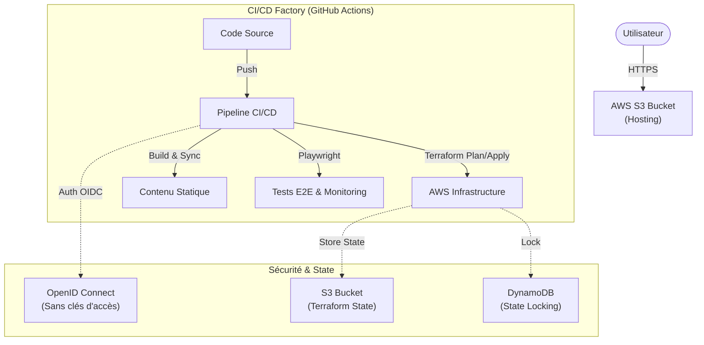

## 🏗️ Architecture Technique

Le projet repose sur une architecture **Serverless** hébergée sur AWS, entièrement provisionnée par code.


## 🧩 La Stack

| Domaine          | Technologie        | Usage                                                                 |
|------------------|--------------------|-----------------------------------------------------------------------|
| Infrastructure   | Terraform          | Provisioning du S3, IAM, Politiques de sécurité (IaC).                |
| Cloud            | AWS                | S3 (Hosting), IAM (Sécurité), Budgets (FinOps).                       |
| CI/CD            | GitHub Actions     | Pipeline unifié : Infra + App + Tests.                                |
| Sécurité         | Trivy & OIDC       | Scan de vulnérabilités IaC et Authentification sans clés ("Keyless"). |
| Qualité          | Playwright         | Tests End-to-End et Synthetic Monitoring quotidien.                   |
| Frontend         | Astro              | Framework web haute performance (Static Site Generation).             |

## ⚙️ Automatisations Clés
1. ### Pipeline "Zero-Touch"
Aucune intervention manuelle n'est requise pour le déploiement.

- Trigger : Push sur main.
- Infra : Terraform valide et applique les changements.
- App : Build Node.js et synchronisation S3 optimisée.

2. ### Sécurité "Shift-Left"
La sécurité est traitée au début du cycle, pas à la fin.

OIDC AWS : Aucune AWS_ACCESS_KEY n'est stockée dans GitHub. L'authentification se fait par jetons éphémères.

Trivy Scan : Chaque commit est scanné pour détecter les mauvaises configurations Terraform (ex: bucket public non désiré, chiffrement manquant).

3. ### Monitoring SRE (Synthetic)
Plutôt que d'attendre qu'un utilisateur signale une panne, le pipeline s'exécute tous les matins à 08h00 UTC.

Il lance un scénario utilisateur complet avec Playwright.

Si le site ne répond pas ou si le logo a disparu, je reçois une alerte immédiate (GitHub Notification).

## 🛠️ Comment déployer ce projet (Localement)
Si vous souhaitez tester ce code :

1. Prérequis : Terraform, Node.js 20+, AWS CLI.

2. Cloner :
```Bash
git clone [https://github.com/Nasticks/portfolio-devops.git](https://github.com/Nasticks/portfolio-devops.git)
cd portfolio-devops
``` 
3. Infrastructure :

```Bash
cd infra
# Le backend S3 est configuré pour mon projet, vous devrez le changer dans provider.tf
terraform init
terraform plan
``` 

4. Application :

```Bash
cd ../app
npm install
npm run dev
```

## 👤 Auteur
Precieux Miberdolphe(Nasticks) - Ingénieur DevOps / Platform Engineer Passionné par l'automatisation, Kubernetes et le Cloud Native.

Ce projet a été réalisé dans une démarche "Best Practices" pour démontrer des compétences techniques concrètes.